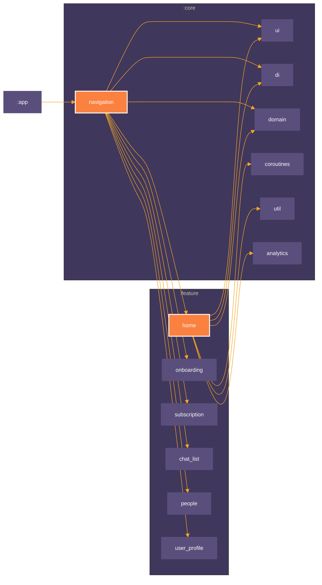

# Android Chat App entirely built with Jetpack Compose (in development)


[](https://www.codefactor.io/repository/github/mobiledevpro/closetalk.app)
[](https://sonarcloud.io/dashboard?id=mobiledevpro_Jetpack-Compose-ChatApp-Template)

[](http://kotlinlang.org/)
[]([http://kotlinlang.org/](https://developer.android.com/jetpack/compose/bom/bom-mapping))
[](https://developer.android.com/build/releases/gradle-plugin)
[](https://github.com/AndroidSDKSources/android-sdk-sources-list)
[](https://developer.android.com/about/versions/13)
[](http://www.apache.org/licenses/LICENSE-2.0)
[](https://developer.android.com/studio/preview)


##
### Try demo:
[](https://play.google.com/store/apps/details?id=com.mobiledevpro.closetalk.app&utm_source=landing)

##


[](https://www.youtube.com/playlist?list=PL9IBbMupfHWrW419OtGlzc7cBEMNqyLa4)

##
### Apps built from this template: 
- [Screenshot Maker - NeonFrame](https://NeonFrame.app) - Make eye-catching screenshots you share on Twitter, Instagram, and others.
 
##
### Tech. stack

* [Kotlin](https://kotlinlang.org/docs/getting-started.html)
* [Coroutines](https://kotlinlang.org/docs/coroutines-overview.html)
* [Jetpack Compose](https://developer.android.com/jetpack/compose) modern toolkit for building native UI
* [Jetpack libs: Navigation, Compose, etc.](https://developer.android.com/jetpack)
* [Material 3](https://m3.material.io/)
* [Koin](https://insert-koin.io/docs/reference/koin-android/compose) for dependency injection
* [Coil](https://coil-kt.github.io/coil/compose/) for image loading
* MVI + modularization with a clean architecture
* GitHub Actions [Complete Guide](https://www.patreon.com/mobiledevpro/shop/power-of-github-actions-complete-guide-943321)

## Notes

#### Plugin to generate Compose Compiler metrics (root/build.gradle.kts)
[Interpreting Compose Compiler Metrics](https://github.com/JetBrains/kotlin/blob/master/plugins/compose/design/compiler-metrics.md)

```kotlin
subprojects {
    tasks.withType<org.jetbrains.kotlin.gradle.tasks.KotlinCompile>().all {
        compilerOptions.freeCompilerArgs.addAll(
            "-P",
            "plugin:androidx.compose.compiler.plugins.kotlin:reportsDestination=" +
                    project.layout.buildDirectory.get().asFile.absolutePath + "/compose_metrics"
        )
        compilerOptions.freeCompilerArgs.addAll(
            "-P",
            "plugin:androidx.compose.compiler.plugins.kotlin:metricsDestination=" +
                    project.layout.buildDirectory.get().asFile.absolutePath + "/compose_metrics"
        )
    }
}
```

#### To debug Firebase Analytics events call it in the terminal
```bash
adb shell setprop log.tag.FA VERBOSE
adb shell setprop log.tag.FA-SVC VERBOSE
adb logcat -v time -s FA FA-SVC
```


##
## UI testing with [Maestro](https://maestro.mobile.dev/):

* Install Maestro: run in terminal ```curl -Ls "https://get.maestro.mobile.dev" | bash```
* Install the app on emulator (doesn't work with physical device)
* Run the flow: run in terminal ```maestro test -c maestro/people-profile-flow.yaml```
* [Sample config](maestro/people-profile-flow.yaml)

##
## Module Graph


### How to create the module graph

```kotlin
 ./gradlew createModuleGraph
```

##
## Author:

<a href="https://github.com/dmitriy-chernysh" target="_blank">
  
</a>

**Dmitri Chernysh**

[](https://www.instagram.com/mobiledevpro/)
[](https://www.youtube.com/@mobiledevpro?sub_confirmation=1&utm_source=github_main_profile)
[](https://patreon.com/mobiledevpro)
[](https://www.linkedin.com/in/dmitriychernysh/)
[](https://www.upwork.com/freelancers/dmitrich)


## License:

Copyright 2025 Dmitri Chernysh

Licensed under the Apache License, Version 2.0 (the "License");
you may not use this file except in compliance with the License.
You may obtain a copy of the License at

       http://www.apache.org/licenses/LICENSE-2.0

Unless required by applicable law or agreed to in writing, software
distributed under the License is distributed on an "AS IS" BASIS,
WITHOUT WARRANTIES OR CONDITIONS OF ANY KIND, either express or implied.
See the License for the specific language governing permissions and
limitations under the License.

## Thanks for the support
**Stargazers**

[](https://github.com/mobiledevpro/closetalk.app/stargazers)

**Forkers**

[](https://github.com/mobiledevpro/closetalk.app/network/members)
